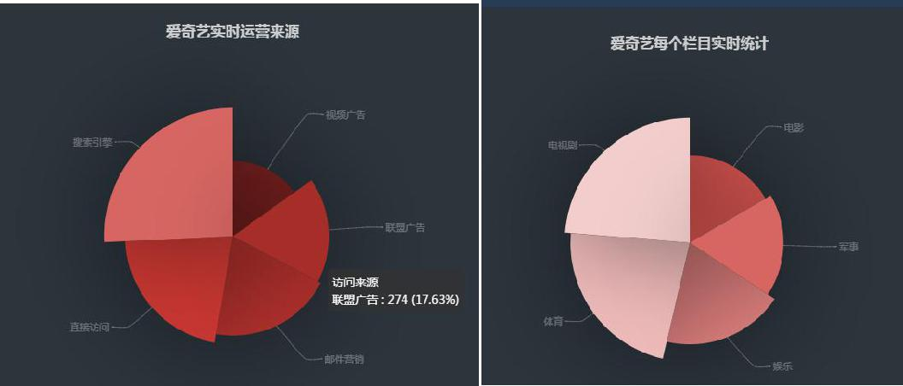
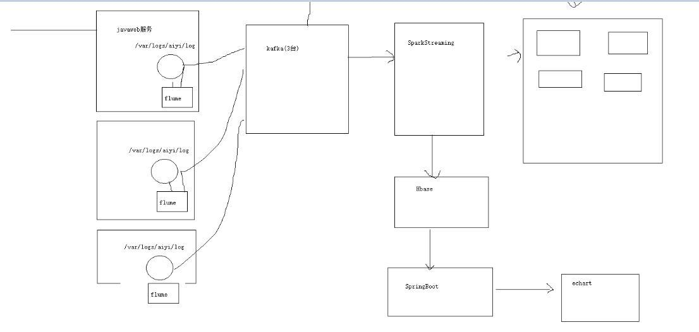
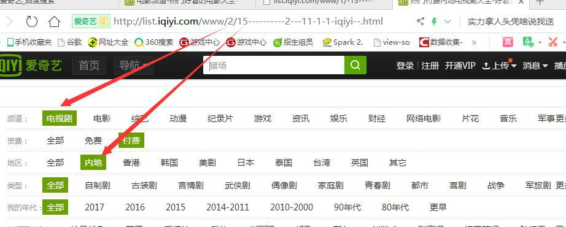
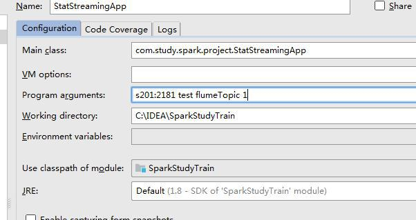
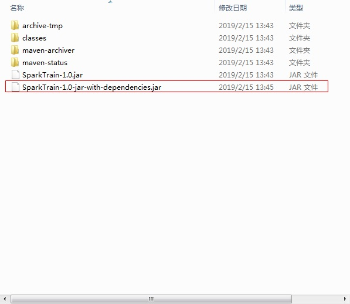

-   需求说明

-   互联网访问日志概述

-   功能开发以及本地运行

-   生产环境运行

>   **需求说明**


-   今天到现在为止的每个类别的访问量

-   今天到现在为止从搜索引擎引流过来的类别的访问量

-   今天到现在为止每个栏目下面的销售额

-   今天到现在为止每个省份的购买量

-   ....



>   **项目使用的技术点：**



>   **互联网访问日志概述**

>   为什么要记录访问日志的行为呢？

>   通过日志我们可以得到网站页面的访问量，网站的黏性，推荐

>   用户行为分析，是指在获得网站访问量基本数据的情况下，对有关数据进行统计、分析，从中发现用户访问网站的规律，并将这些规律与网络营销策略等相结合，从而发现目前网络营销活动中可能存在的问题，并为进一步修正或重新制定网络营销策略提供依据。这是狭义的只指网络上的用户行为分析。

>   **重点分析的数据**

>   用户行为分析应该包含以下数据重点分析：

-   用户的来源地区、来路域名和页面；

-   用户在网站的停留时间、跳出率、回访者、新访问者、回访次数、回访相隔天数；

-   注册用户和非注册用户，分析两者之间的浏览习惯；

-   用户所使用的搜索引擎、关键词、关联关键词和站内关键字；

-   用户选择什么样的入口形式（广告或者网站入口链接）更为有效；

-   用户访问网站流程，用来分析页面结构设计是否合理；

-   用户在页面上的网页热点图分布数据和网页覆盖图数据；

-   用户在不同时段的访问量情况等：

-   用户对于网站的字体颜色的喜好程度。

>   **日志格式字段：**

>   ip 地址 用户名 访问时间 访问的模块地址 使用的方式 .....

>   **意义:**

>   通过对用户行为监测获得的数据进行分析，可以让企业更加详细、清楚地了解用户的行为习惯，从而找出网站、推广渠道等企业营销环境存在的问题，有助于企业发掘高转化率页面，让企业的营销更加精准、有效，提高业务转化率，从而提升企业的广告收益。

>   **日志分析**

>   www/2 --代表电视剧

>   www/1 --代表电影

>   www/6 --综艺

>   www/4 -- 动漫

>   www/3 -- 记录篇



>   **使用 Python 脚本实时产生数据**

因为我们要使用实时数据，不可能从主站拿到，只能模仿，我们一般使用是脚本python或java
 
 generate.py
```
#coding=UTF-8
import random
import time

url_paths = [
   "www/2",
   "www/1",
   "www/6",
   "www/4",
   "www/3",
   "pianhua/130",
   "toukouxu/821"
]

status_code =[404,302,200]

ip_slices=[132,156,124,10,29,167,143,187,30,100]

http_referers = [
"https://www.baidu.com/s?wd={query}",
"https://www.sogou.com/web?qu={query}",
"http://cn.bing.com/search?q={query}",
"https://search.yahoo.com/search?p={query}"
]

search_keyword = [
  "猎场", "快乐人生", "极限挑战", "我的体育老师", "幸福满院"
]
#
def sample_ip():
	slice = random.sample(ip_slices,4)
	return ".".join([str(item) for item in slice])
	
def sample_url():
	return random.sample(url_paths,1)[0]
def sample_status():
    return random.sample(status_code,1)[0]
def sample_referer():
	if random.uniform(0,1) > 0.2:
		return "-"
	refer_str = random.sample(http_referers,1)
	#print refer_str[0]
	query_str = random.sample(search_keyword,1)
	#print query_str[0]
	return refer_str[0].format(query=query_str[0])
   
	
	


#产生log
def generate_log(count=10):
	time_str = time.strftime("%Y-%m-%d %H:%M:%S",time.localtime())
	#f = open("C:\\code\\logs","w+")
	f = open("log","a+")
	while count >= 1:
		query_log = "{ip}\t{localtime}\t\"GET {url} HTTP/1.0\"\t{referece}\t{status1}".format(ip=sample_ip(),url=sample_url(),status1=sample_status(),referece=sample_referer(),localtime=time_str)
		#print query_log
		f.write(query_log+"\n")
		count = count-1;


if __name__ == '__main__':
	generate_log(100)
	#print "1111"
```
>   **通过调度器工具每一分钟产生一批数据**

>   **linux crontab**

```
实例 1：每 1 分钟执行一次 command
命令：*/1 * * * * command

实例 2：每小时的第 3 和第 15 分钟执行
命令：3,15 * * * * command

实例 3：在上午 8 点到 11 点的第 3 和第 15 分钟执行
命令：3,15 8-11 * * * command

实例 4：每隔两天的上午 8 点到 11 点的第 3 和第 15 分钟执行
命令：3,15 8-11 */2 * * command

实例 5：每个星期一的上午 8 点到 11 点的第 3 和第 15 分钟执行
命令：3,15 8-11 * * 1 command

实例 6：每晚的 21:30 重启 smb
命令：30 21 * * * /etc/init.d/smb restart

实例 7：每月 1、10、22 日的 4 : 45 重启 smb
命令：45 4 1,10,22 * * /etc/init.d/smb restart

实例 8：每周六、周日的 1 : 10 重启 smb
命令：10 1 * * 6,0 /etc/init.d/smb restart

实例 9：每天 18 : 00 至 23 : 00 之间每隔 30 分钟重启 smb
命令：0,30 18-23 * * * /etc/init.d/smb restart

实例 10：每星期六的晚上 11 : 00 pm 重启 smb
命令：0 23 * * 6 /etc/init.d/smb restart

实例 11：每一小时重启 smb
命令：* */1 * * * /etc/init.d/smb restart

实例 12：晚上 11 点到早上 7 点之间，每隔一小时重启 smb
命令：* 23-7/1 * * * /etc/init.d/smb restart

实例 13：每月的 4 号与每周一到周三的 11 点重启 smb
命令：0 11 4 * mon-wed /etc/init.d/smb restart

实例 14：一月一号的 4 点重启 smb
命令：0 4 1 jan * /etc/init.d/smb restart

每一分钟执行一次的 crontab 表达式: */1 * * * *

```
vi log_generator.sh
crontab -e */1 * * * * /home/centos/logs/log_generator.sh

chmod +x log_generator.sh

./log_generator.sh


>   tail -200f log 以追加的方式查询日志


### **启动和配置**

>   运行 kafka 需要使用 Zookeeper，所以你需要先启动 Zookeeper

  **启动 kafka**
```
bin/kafka-server-start.sh config/server.properties &
bin/kafka-server-stop.sh config/server.properties &
通过 list 命令查看创建的 topic:
创建一个叫做“flume”的 topic，它只有一个分区，一个副本。
bin/kafka-topics.sh --list --zookeeper s201:2181
创建一个消费者:
bin/kafka-topics.sh --create --zookeeper s201:2181 --replication-factor 1
--partitions 1 --topic flumeTopic
启动 Kafka consumer:
bin/kafka-console-consumer.sh --zookeeper s201:2181 --topic flumeTopic
--from-beginning
```

>   **启动 Flume**

>   bin/flume-ng agent --conf conf --conf-file conf/a1.conf --name a1  -Dflume.root.logger=INFO,console

vi conf/a1.conf
```
# 定义 agent
a1.sources = src1
a1.channels = ch1
a1.sinks = k1
# 定义 sources
a1.sources.src1.type = exec
a1.sources.src1. command =tail -F /home/centos/log/log
a1.sources.src1.channels=ch1
# 定义 sinks
a1.sinks.k1.type = org.apache.flume.sink.kafka.KafkaSink
a1.sinks.k1.topic = flumeTopic
a1.sinks.k1.brokerList = s201:9092
a1.sinks.k1.batchSize = 20
a1.sinks.k1.requiredAcks = 1
a1.sinks.k1.channel = ch1
# 定义 channels
a1.channels.ch1.type = memory
a1.channels.ch1.capacity = 1000
```

  \# 定义 channels

>   a1.channels.ch1.type = memory

>   a1.channels.ch1.capacity = 1000

>   上面 配置文件中提到的默认连接到一个名为 ‘default-flume-topic’ 的 topic" ，实际上是在 flume-ng-kafka-sink 项目中定义的，  如果需要修改默认名称等属性，可以修改 Constants
>   类。

> flume-ng-kafka-sink/impl/src/main/java/com/polaris/flume/sink/下面的Constants.java

>   public static final String DEFAULT_TOPIC = "default-flume-topic";

  **开发环境搭建(pom文件 hbas2.1.1+spark2.3.0+kafka0.8)**
```
< properties>
        <scala.version>2.11.8</scala.version>
        <spark.version>2.3.0</spark.version>
        <hbase.version>2.1.1</hbase.version>
    </properties>
    <dependencies>
        <dependency>
            <groupId>org.scala-lang</groupId>
            <artifactId>scala-library</artifactId>
            <version>${scala.version}</version>
        </dependency>
        <dependency>
            <groupId>org.apache.spark</groupId>
            <artifactId>spark-core_2.11</artifactId>
            <version>${spark.version}</version>
        </dependency>
        <dependency>
            <groupId>org.apache.spark</groupId>
            <artifactId>spark-sql_2.11</artifactId>
            <version>${spark.version}</version>
        </dependency>
        <dependency>
            <groupId>org.apache.spark</groupId>
            <artifactId>spark-hive_2.11</artifactId>
            <version>${spark.version}</version>
        </dependency>
        <dependency>
            <groupId>org.apache.spark</groupId>
            <artifactId>spark-streaming_2.11</artifactId>
            <version>${spark.version}</version>
        </dependency>
        <dependency>
            <groupId>org.apache.hadoop</groupId>
            <artifactId>hadoop-client</artifactId>
            <version>2.7.3</version>
        </dependency>
        <dependency>
            <groupId>org.apache.spark</groupId>
            <artifactId>spark-streaming-kafka-0-8_2.11</artifactId>
            <version>${spark.version}</version>
        </dependency>
        <dependency>
            <groupId>org.apache.hbase</groupId>
            <artifactId>hbase-client</artifactId>
            <version>${hbase.version}</version>
        </dependency>
        <dependency>
            <groupId>org.apache.hbase</groupId>
            <artifactId>hbase-server</artifactId>
            <version>${hbase.version}</version>
        </dependency>
        <dependency>
            <groupId>junit</groupId>
            <artifactId>junit</artifactId>
            <version>4.4</version>
            <scope>test</scope>
        </dependency>
    </dependencies>
```

**开发环境搭建(pom文件 hbas1.2.0+spark2.2.0+kafka0.10)**
```
<properties>
    <scala.version>2.11.8</scala.version>
    <kafka.version>0.10.0.0</kafka.version>
    <spark.version>2.2.0</spark.version>
    <hadoop.version>2.7.2</hadoop.version>
    <hbase.version>1.2.0</hbase.version>
  </properties>


  <dependencies>

    <dependency>
      <groupId>org.scala-lang</groupId>
      <artifactId>scala-library</artifactId>
      <version>${scala.version}</version>
    </dependency>
    <!--kafka依赖-->
    <dependency>
      <groupId>org.apache.kafka</groupId>
      <artifactId>kafka_2.11</artifactId>
      <version>0.10.0.0</version>
    </dependency>

    <dependency>
      <groupId>org.apache.hadoop</groupId>
      <artifactId>hadoop-client</artifactId>
      <version>${hadoop.version}</version>
    </dependency>
    <dependency>
      <groupId>org.apache.hbase</groupId>
      <artifactId>hbase-client</artifactId>
      <version>1.2.0</version>
    </dependency>

    <dependency>
      <groupId>org.apache.hbase</groupId>
      <artifactId>hbase-server</artifactId>
      <version>1.2.0</version>
    </dependency>

    <dependency>
    <groupId>org.apache.spark</groupId>
    <artifactId>spark-streaming_2.11</artifactId>
    <version>2.1.0</version>
    </dependency>

    <dependency>
      <groupId>org.apache.spark</groupId>
      <artifactId>spark-streaming-kafka-0-10_2.11</artifactId>
      <version>2.1.0</version>
    </dependency>

  </dependencies>
```

<br>
   **打通 Flume&Kafka&Spark Streaming**
<br><br>


>   在 spark 应用程序接收到数据并完成记录数统计


>   次代码为 0.8 版本的
```
/**
* 使用 sparkStreaming 处理 Kafka 过来数据
*/
object StatStreamingApp {
def main(args: Array[String]): Unit = {
if(args.length != 4){
println("Usage:StatStreamingApp<zkQuorum><group><topic>
<numberThread>")
System.exit(1)
}
val Array(zkQuorum,groupId,topis,numberThread) = args
val sparkConf = new
SparkConf().setMaster("local[4]").setAppName("StatStreamingApp")
val ssc = new StreamingContext(sparkConf,Seconds(60))
val topicMap = topis.split(",").map((_,numberThread.toInt)).toMap
val messages = KafkaUtils.createStream(ssc, zkQuorum, groupId, topicMap)
//测试接收数据
messages.map(_._2).count().print()
}
}
```



>   **kafka0.10 之后的代码

```
import org.apache.kafka.common.serialization.StringDeserializer
import org.apache.spark.streaming.{Seconds, StreamingContext,
kafka010}
import
org.apache.spark.streaming.kafka010.ConsumerStrategies.Subscri
be
import org.apache.spark.streaming.kafka010.KafkaUtils
import
org.apache.spark.streaming.kafka010.LocationStrategies.PreferC
onsistent
/**
* Created by zhang on 2018/11/21.
* 使用 sparkStreaming 处理 Kafka 过来数据
*/
object StatStreamingApp {
def main(args: Array[String]): Unit = {
val ssc = new StreamingContext("local[*]",
"StatStreamingApp", Seconds(5))
val kafkaParams = Map[String, Object](
"bootstrap.servers" -> "s201:9092,s202:9092",
"key.deserializer" -> classOf[StringDeserializer],
"value.deserializer" -> classOf[StringDeserializer],
"group.id" -> "example",
"auto.offset.reset" -> "latest",
"enable.auto.commit" -> (false: java.lang.Boolean)
)
val topics = List("flumeTopic").toSet
val lines = KafkaUtils.createDirectStream[String, String](
ssc,
PreferConsistent,
Subscribe[String, String](topics, kafkaParams)
).map(_.value())
lines.print()
ssc.start();
ssc.awaitTermination();
}
}
```


>   **功能开发**

   目标：今天到现在为止，每个栏目的访问量

  分析：yyyyMMdd categoryId

   使用数据库进行存储我们的统计结果

   Spark Streaming 把统计的结构吸入到数据库里面

   可视化前端根据：yyyyMMdd categoryId 把数据库里面的统计结构展示出来

   选择什么数据库作为统计结构存储呢？

   关系型数据库 RDBMS：MySQL Oracle

   day categoryId click_count

   20181117 1 10

  20181117 2 19

  下一个批次数据进来以后

  我们需要取出 20181117 1 对应的值 10 + 对应的数据

   非关系型数据库：Hbase，Redis

  Hbase 一个 API 就能搞定，非常方便

>   **使用 HBase 必须要做环境的开启：**

```
 Hdfs start-all.sh  

 zk   
 
 Hbase start-hbase.sh
 ```

>   **使用 Hbase**

   ./hbase shell
```
list 查看对应的数据库
创建表：
create ‘category_clickcount’,’info’
Rowkey 设计：
day_categoryid
desc ‘category_clickcount’
scan ‘category_clickcount’ 查看表
```

>   操作 Hbase 数据库的工具类1.2版本：
```java
import org.apache.hadoop.conf.Configuration;
import org.apache.hadoop.hbase.client.HBaseAdmin;
import org.apache.hadoop.hbase.client.HTable;
import org.apache.hadoop.hbase.client.Put;
import org.apache.hadoop.hbase.util.Bytes;
import java.io.IOException;
 
public class HBaseUtils {
HBaseAdmin admin = null;
Configuration configration = null;
/**
* 私有构造方法
*/
private HBaseUtils(){
configration = new Configuration();
configration.set("hbase.zookeeper.quorum","s201:2181");
configration.set("hbase.rootdir","hdfs://s201/hbase");
try {
admin = new HBaseAdmin(configration);
} catch (IOException e) {
e.printStackTrace();
}
}
private static HBaseUtils instance = null;
public static synchronized HBaseUtils getInstance(){
if(null == instance){
instance = new HBaseUtils();
}
return instance;
}
/**
* 根据表名获取到 Htable 实例
*/
public HTable getTable(String tableName){
HTable table = null;
try {
table = new HTable(configration,tableName);
} catch (IOException e) {
e.printStackTrace();
}
return table;
}
/**
* 添加一条记录到 Hbase 表 70 30 128 32 核 200T 8000
* @param tableName Hbase 表名
* @param rowkey Hbase 表的 rowkey
* @param cf Hbase 表的 columnfamily
* @param column Hbase 表的列
* @param value 写入 Hbase 表的值
*/
public void put(String tableName,String rowkey,String cf,String column,String value){
HTable table = getTable(tableName);
Put put = new Put(Bytes.toBytes(rowkey));
put.add(Bytes.toBytes(cf),Bytes.toBytes(column),Bytes.toBytes(value));
try {
table.put(put);
} catch (IOException e) {
e.printStackTrace();
}
}
public static void main(String[] args) {
//HTable table = HBaseUtils.getInstance().getTable("category_clickcount");
//System.out.println(table.getName().getNameAsString());
String tableName = "category_click";
String rowkey = "20271111_88";
String cf="info";
String column ="click_count";
String value = "2";
HBaseUtils.getInstance().put(tableName,rowkey,cf,column,value);
}
}
```

>   操作 Hbase 数据库的工具类2.1版本：
```java
import org.apache.hadoop.conf.Configuration;
import org.apache.hadoop.hbase.client.HBaseAdmin;
import org.apache.hadoop.hbase.client.HTable;
import org.apache.hadoop.hbase.client.Put;
import org.apache.hadoop.hbase.util.Bytes;
import java.io.IOException;
/**
* Created by zhang on 2018/11/18.
*/
public class HBaseUtils {
HBaseAdmin admin = null;
Configuration configration = null;
/**
* 私有构造方法
*/
private HBaseUtils(){
configration = new Configuration();
configration.set("hbase.zookeeper.quorum","s201:2181");
configration.set("hbase.rootdir","hdfs://s201/hbase");
try {
admin = new HBaseAdmin(configration);
} catch (IOException e) {
e.printStackTrace();
}
}
private static HBaseUtils instance = null;
public static synchronized HBaseUtils getInstance(){
if(null == instance){
instance = new HBaseUtils();
}
return instance;
}
/**
* 根据表名获取到 Htable 实例
*/
public HTable getTable(String tableName){
HTable table = null;
try {
table = new HTable(configration,tableName);
} catch (IOException e) {
e.printStackTrace();
}
return table;
}
/**
* 添加一条记录到 Hbase 表 70 30 128 32 核 200T 8000
* @param tableName Hbase 表名
* @param rowkey Hbase 表的 rowkey
* @param cf Hbase 表的 columnfamily
* @param column Hbimport org.apache.hadoop.conf.Configuration;
                  import org.apache.hadoop.hbase.HBaseConfiguration;
                  import org.apache.hadoop.hbase.TableName;
                  import org.apache.hadoop.hbase.client.Connection;
                  import org.apache.hadoop.hbase.client.ConnectionFactory;
                  import org.apache.hadoop.hbase.client.Put;
                  import org.apache.hadoop.hbase.client.Table;
                  import org.apache.hadoop.hbase.util.Bytes;
                  
                  import java.io.IOException;
                  
                  /**
                   * Hbase工具类
                   */
                  public class HBaseUtils {
                      Configuration configration = null;
                      public Connection connection = null;
                      private static HBaseUtils instance = null;
                  
                      private HBaseUtils() {
                          configration = HBaseConfiguration.create();
                          configration.set("hbase.zookeeper.quorum", "node2,node3,node4");
                          configration.set("hbase.zookeeper.property.clientPort", "2181");
                          try {
                              connection = ConnectionFactory.createConnection(configration);
                          } catch (IOException e) {
                              e.printStackTrace();
                          }
                      }
                  
                      public static synchronized HBaseUtils getInstance() {
                          if (null == instance) {
                              instance = new HBaseUtils();
                          }
                          return instance;
                      }
                  
                      public Table getTable(String tableName) {
                          Table table = null;
                          TableName tn = TableName.valueOf(tableName);
                          try {
                              table = connection.getTable(tn);
                          } catch (IOException e) {
                              e.printStackTrace();
                          }
                          return table;
                      }
                  
                  
                      public void put(String tableName, String rowkey, String cf, String column, String value) throws IOException {
                          //new 一个列  ，hgs_000为row key
                          Put put = new Put(Bytes.toBytes(rowkey));
                          //下面三个分别为，列族，列名，列值
                          put.addColumn(Bytes.toBytes(cf), Bytes.toBytes(column), Bytes.toBytes(value));
                          TableName tn = TableName.valueOf(tableName);
                          //得到 table
                          Table table = connection.getTable(tn);
                          //执行插入
                          table.put(put);
                      }
                  
                      public static void main(String[] args) throws IOException {
                          String tableName = "category_clickcount";
                          String rowkey = "20271111_88";
                          String cf = "info";
                          String column = "click_count";
                          String value = "1";
                          //Table table = HBaseUtils.getInstance().getTable("category_clickcount");
                          //System.out.println(table.getName().getNameAsString());
                          HBaseUtils.getInstance().put(tableName, rowkey, cf, column, value);
                      }
                  }
                 }

```

>   **使用 spark-streaming 完成数据清洗操作**

>   1）时间工具类

```
156.187.29.132 2018-11-20 00:39:26 "GET www/2 HTTP/1.0" - 200 
30.187.124.132 2018-11-20 00:39:26 "GET www/2 HTTP/1.0" - 302
```
DataUtil.java
```
object DataUtils {
val YYYYMMDDHHMMSS_FORMAT = FastDateFormat.getInstance("yyyy-MM-dd HH:mm:ss");
val TARGE_FORMAT = FastDateFormat.getInstance("yyyyMMdd");
def getTime(time: String)={
YYYYMMDDHHMMSS_FORMAT.parse(time).getTime
}
def parseToMinute(time:String)={
TARGE_FORMAT.format(new Date(getTime(time)))
}
def main(args: Array[String]): Unit = {
println(parseToMinute("2018-11-22 01:20:20"))
}
}
```


  **针对数据进行分析**

  清洗数据，过滤出无用数据
```
val cleanData = logs.map(line =>{
val infos = line.split("\t")
val url = infos(2).split(" ")(1)
var categaryId = 0
//把爱奇艺的类目编号拿到了
if(url.startsWith("www")){
categaryId = url.split("/")(2).toInt
}
ClickLog(infos(0),DataUtils.parseToMin(infos(1)),categaryId,infos(4).toInt,infos(3))
}).filter(clickLog=>clickLog.categaryId!=0)
cleanData.print()
```

>   **点击 ClickLog 类**
```
case class ClickLog(ip: String, time: String, categaryId: Int, refer: String, statusCode: Int)
```

>   产生的日志：

```
ClickLog(187.124.156.143,20181122,6,-,404)
ClickLog(29.132.10.100,20181122,1,-,302)
ClickLog(100.167.30.124,20181122,3,-,404)
ClickLog(30.10.167.132,20181122,4,-,200)
ClickLog(132.124.100.143,20181122,4,-,200)
ClickLog(167.132.10.156,20181122,4,http://cn.bing.com/search?q=幸福满院,302)
ClickLog(29.143.10.187,20181122,3,-,302
```

>   API 操作 Hbase

```
/**
* 视频类别点击数
*
* @param day_ category 对应的就是 Hbase 中的 rowkey 20181118
* @param click_count 对应的 20181118 的点击数
*/
case class
CategaryClickCount(day_categaryId:String,click_count:Int)
```
CategaryClickCountDao
```
import scala.collection.mutable.ListBuffer
import com.study.sparkstudy.domain.CategaryClickCount
import com.study.sparkstudy.utils.HBaseUtils
import org.apache.hadoop.hbase.util.Bytes
import org.apache.hadoop.hbase.client.Get
object CategaryClickCountDao {
  val tableName = "category_clickcount"
  val cf = "info"
  val qualifer = "click_count"
  /**
    * 保存数据
    *
    * @param list
    */
  def save(list: ListBuffer[CategaryClickCount]): Unit = {
    val table = HBaseUtils.getInstance().getTable(tableName)
    for (els <- list) {
      import org.apache.hadoop.hbase.util.Bytes
      table.incrementColumnValue(Bytes.toBytes(els.categaryID), Bytes.toBytes(cf), Bytes.toBytes(qualifer), els.clickCout)
    }
  }

  def count(day_categaryId: String): Long = {
    val table = HBaseUtils.getInstance().getTable(tableName)
    val get = new Get(Bytes.toBytes(day_categaryId))
    val values = table.get(get).getValue(Bytes.toBytes(cf), Bytes.toBytes(qualifer))
    if (values == null) {
      0L
    } else {
      Bytes.toLong(values)
    }
  }

  def main(args: Array[String]): Unit = {
    val list = new ListBuffer[CategaryClickCount]
    list.append(CategaryClickCount("20181122_8", 300))
    list.append(CategaryClickCount("20181122_9", 300))
    list.append(CategaryClickCount("20181122_10", 1600))
    save(list)

    print(count("20181122_8") + "/t" + count("20181122_9") + "/t" + count("20181122_10"))
  }

}
```
>   **保存收集数据到 HBase 里面**

```
cleanLog.map(log=>{
(log.time.substring(0,8)+"_"+log.categaryId,1)
}).reduceByKey(_+_).foreachRDD(rdd=>{
rdd.foreachPartition(partriosRdds=>{
val list = new ListBuffer[CategaryClickCount]
partriosRdds.foreach(pair=>{
list.append(CategaryClickCount(pair._1,pair._2))
})
CategaryClickCountDAO.save(list)
})
})
```

>   功能二：功能一+从搜索引擎引流过来的

>   Hbase 表设计

>   create 'category_search_clickcount','info'

>   rowkey 设计：也是根据我们的业务需求来的

>   封装类
```
case class CategarySearchClickCount(day_search_categary: String, clickCout: Int)
```

>   **DAO 操作类**
```
import com.study.sparkstudy.utils.HBaseUtils
import org.apache.hadoop.hbase.client.Get
import org.apache.hadoop.hbase.util.Bytes
import com.study.sparkstudy.domain.CategarySearchClickCount
import scala.collection.mutable.ListBuffer

object CategarySearchClickCountDao {
  val tableName = "categary_search_count"
  val cf = "info"
  val qualifer = "click_count"

  /**
    * 保存数据
    *
    * @param list
    */
  def save(list: ListBuffer[CategarySearchClickCount]): Unit = {
    val table = HBaseUtils.getInstance().getTable(tableName)
    for (els <- list) {
      import org.apache.hadoop.hbase.util.Bytes
      import org.apache.hadoop.hbase.util.Bytes
      table.incrementColumnValue(Bytes.toBytes(els.day_search_categary), Bytes.toBytes(cf), Bytes.toBytes(qualifer), els.clickCout)
    }
  }

  def count(day_categaryId: String): Long = {
    val table = HBaseUtils.getInstance().getTable(tableName)
    val get = new Get(Bytes.toBytes(day_categaryId))
    val values = table.get(get).getValue(Bytes.toBytes(cf), Bytes.toBytes(qualifer))
    if (values == null) {
      0L
    } else {
      Bytes.toLong(values)
    }
  }

  def main(args: Array[String]): Unit = {
    val list = new ListBuffer[CategarySearchClickCount]
    list.append(CategarySearchClickCount("20171122_1_1", 300))
    list.append(CategarySearchClickCount("20171122_2_1", 300))
    list.append(CategarySearchClickCount("20171122_1_2", 1600))
    save(list)

    print(count("20171122_1_1") + "---" + count("20171122_2_1") + "---" + count("20171122_1_2") + "---")
  }

}
```

>   **业务功能实现**
``` 
cleanLog.map(log=>{
val referer = log.refer.replace("//","/")
val splits = referer.split("/")
var host = ""
if(splits.length > 2){
host = splits(1)
}
(host,log.categaryId,log.time)
}).filter(_._1!="").map(x =>{
(x._3.substring(0,8)+"_"+x._1+"_"+x._2,1)
}).reduceByKey(_+_).foreachRDD(rdd=>{
rdd.foreachPartition(partitionRecods=>{
val list = new ListBuffer[CategarySearchClickCount]
partitionRecods.foreach(pair=>{
list.append(CategarySearchClickCount(pair._1,pair._2))
})
CategarySearchClickCountDAO.save(list)
})
})
```

>   **生成环境上运行代码**

>   1）打包
```
   <build>
        <plugins>
            <plugin>
                <artifactId>maven-assembly-plugin</artifactId>
                <configuration>
                    <archive>
                        <manifest>
                            <!--这里要替换成jar包main方法所在类 -->
                            <mainClass>com.study.sparkstudy.project.StatStreamingApp</mainClass>
                        </manifest>
                    </archive>
                    <descriptorRefs>
                        <descriptorRef>jar-with-dependencies</descriptorRef>
                    </descriptorRefs>
                </configuration>
                <executions>
                    <execution>
                        <id>make-assembly</id> <!-- this is used for inheritance merges -->
                        <phase>package</phase> <!-- 指定在打包节点执行jar包合并操作 -->
                        <goals>
                            <goal>single</goal>
                        </goals>
                    </execution>
                </executions>
            </plugin>
        </plugins>
    </build>
```

>   2）上传 jar 包到对应的服务器上面

>   3）运行
``` 
spark-submit --master spark://s201:7077 --class com.study.spark.project.StatStreamingApp
/home/centos/dowload/SparkTrain.jar
```

>   3）开启 kafka ，flume，hbase，hadoop，spark

>   4）清空 hbase 里面的数据

>   truncate ‘表名’

>   5）执行日志生成器
