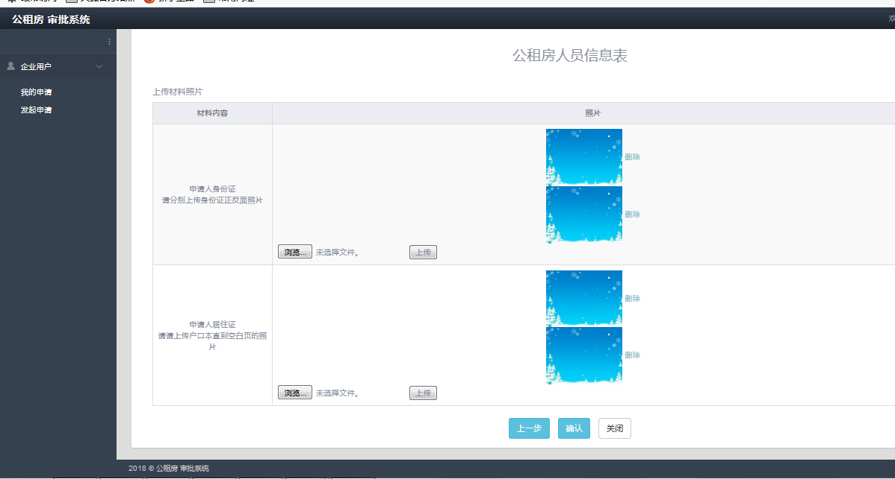

3.2功能需求分析

结合公租房审批系统的实际需求，我将系统分为四个主模块：登录模块、企业模块、审批人员模块、管理员模块。企业用户登录后提交申请由房管局对企业和员工进入审批、然后由委办对企业进行审批、人社局对员工进行审批、最后由人才办进行终审系。企业查看基本信息和申请列表以及发起申请
。房管局：材料预审，资质审核，审核企业的认证管理；房管局资质审核审批通过后系统将根据企业所属委办推送到对应委办（科委/金融办/商委）进行审批；人社局和人才办资质审核。管理员可为审批人用户修改用户信息、权限管理和申请参数设置。审批系统流程如图3.1所示。

图3.1 审批系统流程图

1．企业用户模块：企业成功登录系统后，若企业首次登录系统，需要输入和绑定邮箱确认邮箱的有效性。企业成功登录系统后，可以打印和修改企业的基本信息，查看企业的申请列表和发起申请。企业用户用例图如图3.2所示。

图3.2企业用户用例图

2.
房管局模块：房管局的审批人员登录后，申请提交后首先会推送到房管局进行材料预审。材料预审审批通过后系统将推送到房管局资质审核进行审批。根据提交时间顺序排序。人才办的资质审核终审通过后系统推送到房管局现场审核进行审批。红色字体的待审批数据表示此条待审批批次已在预警期限内，已优先排列，需尽快审批，点击“审批”，进入公司审批页面，显示公司信息并审批，可点击“员工”切换至人员列表查看人员信息。公司信息未审批，人员信息只可查看，不可审批。房管局的认证企业管理可对系统所有企业进行增删改查的操作。房管局用例图如图3.3所示。

图3.3房管局用例图

3.
委办模块：委办登录后，房管局资质审核审批通过后系统将根据企业所所属委办推送到对应委办（科委/金融办/商委）进行审批。委办只能审核公司信息，人员信息只可查看。委办的认证企业管理根据对应的企业行业类型，可对相应的所属委办的企业进行操作。委办用例图如图3.4所示。

图3.4 委办用例图

4.
人社局模块：人社局人员登录后，委办资质审核审批通过后提交到人社局资质审核进行审批。人社局资质审核只审核人员信息，公司信息只可查看。人社局用例图如图3.5所示。

图3.5 人社局用例图

5.
人才办模块：商委、科委、金融办的企业人社局资质审核审批通过后系统将推送到人才办资质审核进行终审。公司信息未审批，人员信息只可查看，不可审批。必须先审核公司信息。“绿色通道”仅供企业类型为“人才办”的企业进行资质审核终审。房管局资质审核审批通过后便提交到人才办绿色通道进行终审。人才办的认证企业管理可对系统所有企业进行增删改查的操作。人才办用例图如图3.6所示。

图 3.6 人才办用例图

6．管理员模块：权限管理功能是对每个用户帐号设置相应的权限，申请参数申请功能包括即每个部门审批的期限和预警的期限以及设置起始时间和申请结算时间。用户管理是可以对审批人员的姓名、帐号和密码进行修改和删除的操作。系统管理员用例图如图3.7所示。

图3.7 系统管理员用例图

第四章 系统设计

系统需求分析阶段之后，将寻找实现目标系统的解决方案。可以先站在系统总体的角度上可以站在全局角度上，先可以抽象设计出软件结构。为下面的系统详细设计与实现起到逐步求精的的作用。

4.1 系统功能设计

本系统包括系统登录模块，企业用户模块，审批部门模块，管理员模块。企业可以发起申请和绑定邮箱。审批部门可以资质审核和企业认证管理。管理员可以用户管理、权限管理、申请参数管理。具体模块功能如图4.1所示。

图4.1 公租房审批系统功能模块图

4.2 系统动态交互建模

根据公租房审批系统的分析可知，多个用户角色和系统之间有着重要的信息交互。企业修改企业信息和发起申请到数据库，房管局审批企业和员工的材料和资质，科委审批企业的材料和资质，人社局审核员工的材料和资质，人才办最终终审企业和员工的材料和资质。对此审批系统，将从“企业提交申请”，“房管局审批”，“委办审批”，“人社局审批”，“人才办审批”等角色功能设计其动态交互过程。

1.  “企业申请”功能顺序交互图

2.  企业用户进入登录页面输入帐号和密码，提交数据；

3.  若企业用户首次登录系统，需绑定邮箱；

4.  企业登录成功后进入企业信息页面；

5.  企业邮箱绑定成功后自动跳转到企业信息页；

6.  在企业信息页面可以发起申请；

7.  企业信息从数据库查询获取并显示；

8.  申请发起成功后保存到数据库；

根据以上流程，可具体得出企业申请顺序图具体如下图4.2所示。

图4.2 企业申请顺序图

2. “房管局审批”功能顺序交互图

1.  房管局用户进入登录页面输入帐号和密码，提交数据；

2.  登录成功后，从数据中查询待审核材料企业，并从获取待审核材料企业的信息；

3.  企业材料审核通过后进入员工材料审核；

4.  企业和员工材料审核通过后，进入企业的资质审核；

5.  材料审核完成后，从数据库获取等待资质审查的企业；

6.  企业资质审查成功后，进去员工的资质审查；

7.  资质审查完成后保存到数据库；

根据以上流程，可具体得出房管局审核顺序图具体如下图4.3所示。

图4.3 房管局审核顺序图

3. “委办审批”功能顺序交互图

1.  委办用户进入登录页面输入帐号和密码，提交数据；

2.  登录成功后，从数据中查询待审核材料企业，并从获取待审核材料企业的信息；

3.  企业材料审核通过后进入公司资质审核；

4.  企业和员工材料审核通过后，进入企业的资质审核；

5.  企业资质审核完成后，保存结果到数据库；

根据以上流程，可具体得出委办审核顺序图具体如下图4.4所示。

图4.4 委办审核顺序图

4. “人社局审批”功能顺序交互图

1.  人社局用户进入登录页面输入帐号和密码，提交数据；

2.  登录成功后，从数据中查询待审核材料企业，并从获取待审核材料企业的信息；

3.  点击进入企业信息页面，切换员工列表；

4.  从数据库中获取待审核的员工列表；

5.  员工资质审核完成后，保存结果到数据库；

根据以上流程，可具体得出人社局审核顺序图具体如下图4.5所示。

图4.5 人社局审核顺序图

4. “人才办审批”功能顺序交互图

1.  人才办用户进入登录页面输入帐号和密码，提交数据；

2.  登录成功后，从数据中查询待审核材料企业，并从获取待审核材料企业的信息；

3.  点击进入企业信息页面，获取企业信息，进行企业资质审查；

4.  企业资质审查通过后，进入员工资质审查；

5.  员工资质审核完成后，保存审查结果到数据库；

6.  人才办审核完成后，将保存到数据库完成审核

根据以上流程，可具体得出人才办审核顺序图具体如下图4.6所示。

图4.6 人才办审核顺序图

4.3 数据库设计

数据库是确保数据流转的必备要素，是软件系统中最重要的基础架构之一。数据库的设计指的就是对数据库表结构的设计。本系统和数据库有着大量的交互，数据库设计好坏直接关系到在整个项目。良好的数据设计往往能够减少开发的负担，完美的体现出系统的流畅和优势。不好的数据库设计会导致系统的响应时间极慢，严重的甚至会导致系统崩溃。所以，数据库的设计对系统起着重要作用。在对数据库设计过程中，需要首先对进行系统分析而得到的信息的数据后进行分析以及对各种数据存储之间的关系进行分析，根据分析结果设计出系统的关系模式。主要通过E-R图设计方法进行分析和设计。

4.3.1 数据库E-R图

根据上面对于系统的分析，可以抽象出数据库的一些实体对象。有用户信息登录，企业用户进入后可以看到企业详细信息、企业需要绑定邮箱发送消息、公司的申请进度、公司申请情况、员工申请信息、员工的申请进度，通过后有企业和员工信息审批完成。申请人员照片存储路径、公司照片存储路径、管理员根据时间设置警告和开始申请时间。系统的实体包括用户信息，企业信息，邮箱绑定，公司申请进度，公司申请，公司员工申请进度，公司照片，员工申请信息，员工照片，时间设置。

（1）用户信息实体，其属性包括：ID号，帐号，密码真实名字，电话号码，邮箱，创建的时间，创建者，修改者，修改的日期。用户信息实体属性图如下图4.7所示。

图4.7 用户信息实体属性图

（2）企业信息实体，其属性包括：企业ID，公司状态，申请人数，公司名，注册地址，办公地址，注册资金，上一年所交税收数，员工人数，公司所属委办，联系人，座机，邮箱，联系电话，系统代码，创建的时间，创建者，修改者，修改日期。企业信息实体属性图如下图4.8所示。

图4.8 企业信息实体属性图

（3）邮箱绑定实体，其属性包括：ID，公司的id，链接码，绑定的邮箱，是否绑定成功，创建的时间，创建者，修改者，修改日期。邮箱绑定实体属性图如下图4.9所示。

图4.9 邮箱绑定实体属性图

（4）公司申请实体，其属性包括：申请ID，公司id，申请数量，通过数量，状态，能申请的员工数，申请公司名，申请号，选择地方号。公司实体属性图如下图4.10所示。

图4.10 公司申请实体属性图

（5）公司申请进度实体，其属性包括：ID，申请日期，申请状态，申请步骤，公司id，创建时间，创建者，修改者，修改时间，申请id，返回状态，驳回理由。公司申请进度实体属性图如下图4.11所示。

图4.11 公司申请进度实体属性图

（6）员工申请信息实体，其属性包括：ID，公司id，申请id，户籍地，所选小区，个人婚姻状态，学历证书编号，毕业学校，毕业时间，专业，符合条件，身份证号码，申请人号码，创建者，修改者，信息修改日期，住宅地址，面积，产权，住总人口，户型。员工申请信息实体属性图如下图4.12所示。

图4.12 员工申请信息实体属性图

（7）公司员工申请进度实体，其属性包括：ID，申请日期，状态，申请步骤，申请人id，创建时间，创建者，修改者，接收号。公司员工申请进度实体属性图如下图4.13所示。

图4.13 公司员工申请进度实体属性图

（8）公司照片实体，其属性包括：ID，公司ID，组织机构代码照片路径，组织机构代码证上传名，税务登记证号码，税务登记证路径，税务登记证上传名，营业执照编号，营业执照路径，营业执照上传名。公司员工申请进度实体属性图如下图4.14所示。

图4.13 公司照片实体属性图

图4.14 公司员工申请进度实体属性图

（9）申请人员照片实体，其属性包括：ID，申请者id,照片类型，照片名字，相对路径名称。申请人员照片实体属性图如下图4.15所示。

图4.15申请人员照片实体属性图

（10）时间设置实体，其属性包括：ID号，类型，审核流程，审核时间限制，审核警告时间限制。时间设置实体属性图如下图4.16所示。

图4.16时间设置实体属性图

通过上述的实体联系图可得到一个用户信息可以关联一个企业信息，一个企业信息可以绑定一个邮箱，一个企业信息可以上传多张照片，一个企业信息可以发起一个公司申请，一个公司申请对应一个公司申请进度，一个公司申请包含多个员工申请信息，一个员工申请信息可以上传多个申请人员照片，一个员工申请信息对用一个员工申请进度。由此可得系统的总体E-R图如图4.17所示。

图4.17 系统总体E-R图

4.3.2 数据库表设计

根据上述的系统需求分析可知，确定本次系统开发需要的表如下：

（1）用户信息表(global user)，主要用来用户登录进入系统，具体如表4.1所示。

表4.1用户信息表(global_user)

| 字段名     | 类型     | 长度 | 允许空值 | 主键 | 说明       |
|------------|----------|------|----------|------|------------|
| id         | int      | 11   |          | 是   | id自动增长 |
| password   | varchar  | 200  | 是       |      | 密码       |
| username   | varchar  | 200  | 是       |      | 帐号       |
| realname   | varchar  | 50   | 是       |      | 真实名字   |
| tel        | int      | 13   | 是       |      | 电话号码   |
| email      | varchar  | 50   | 是       |      | 邮箱       |
| createDate | datetime | 0    | 是       |      | 创建的时间 |
| createBy   | varchar  | 50   | 是       |      | 创建者     |
| modifyBy   | varchar  | 50   | 是       |      | 修改者     |
| modifyDate | datetime | 0    | 是       |      | 修改的日期 |

（2）企业信息表(wdit_company)，记录企业的基本信息，具体如表4.2所示。

表4.2企业信息表(wdit_company)

| 字段名               | 类型     | 长度 | 允许空值 | 主键 | 说明             |
|----------------------|----------|------|----------|------|------------------|
| id                   | int      | 20   |          | 是   | id自动增长       |
| valid                | int      | 11   | 是       |      | 公司的是否有效   |
| applicationNum       | varchar  | 11   | 是       |      | 申请人数         |
| applicant            | varchar  | 50   | 是       |      | 公司名           |
| registerAddress      | varchar  | 200  | 是       |      | 注册地址         |
| officeAddress        | varchar  | 200  | 是       |      | 办公地址         |
| registerMoney        | double   | 50   | 是       |      | 注册资金         |
| oneYearIsTaxAmount   | double   | 50   | 是       |      | 上一年所交税收数 |
| staffNum             | int      | 11   | 是       |      | 员工人数         |
| Companyclassfication | int      | 11   | 是       |      | 公司所属委办     |
| linkman              | varchar  | 50   | 是       |      | 联系人           |
| email                | varchar  | 50   | 是       |      | 邮箱             |
| tel                  | varchar  | 50   | 是       |      | 联系电话         |
| code                 | varchar  | 50   | 是       |      | 系统代码         |
| createDate           | datetime | 0    | 是       |      | 创建的日期       |
| createBy             | varchar  | 50   | 是       |      | 创建者           |
| modifyBy             | varchar  | 50   | 是       |      | 修改者           |
| modifyDate           | datetime | 0    | 是       |      | 信息修改日期     |

（3）邮箱绑定表（wdit_bind），主要用来和企业绑定发送消息，具体如表4.3所示。

表4.3 企业邮箱绑定表（wdit_bind）

| 字段名     | 类型     | 长度 | 允许空值 | 主键 | 说明         |
|------------|----------|------|----------|------|--------------|
| id         | int      | 11   |          | 是   | id自动增长   |
| companyId  | int      | 11   | 是       |      | 公司的id     |
| code       | varchar  | 200  | 是       |      | 链接码       |
| mail       | varchar  | 50   | 是       |      | 绑定的邮箱   |
| issuccess  | int      | 11   | 是       |      | 是否绑定成功 |
| createDate | datetime | 0    | 是       |      | 创建的时间   |
| createBy   | varchar  | 50   | 是       |      | 创建者       |
| modifyBy   | varchar  | 50   | 是       |      | 修改者       |
| modifyDate | datetime | 0    | 是       |      | 修改的日期   |

（4）公司申请进度表（wdit_company_approval），主要用查看目前企业申请的进度，具体如表4.4所示。

表4.4公司申请进度表（wdit_company_approval）

| 字段名        | 类型     | 长度 | 允许空值 | 主键 | 说明       |
|---------------|----------|------|----------|------|------------|
| id            | int      | 20   |          | 是   | id自动增长 |
| approval_Date | datetime | 0    | 是       |      | 申请日期   |
| status        | int      | 50   | 是       |      | 申请状态   |
| approvalStep  | int      | 50   | 是       |      | 申请步骤   |
| companyId     | int      | 50   | 是       |      | 公司id     |
| createDate    | datetime | 50   | 是       |      | 创建时间   |
| createBy      | varchar  | 0    | 是       |      | 创建者     |
| modifyBy      | varchar  | 50   | 是       |      | 修改者     |
| modifyDate    | datetime | 11   | 是       |      | 修改时间   |
| request_Id    | int      | 11   | 是       |      | 申请id     |
| IsReturn      | int      | 11   | 是       |      | 1为不通过  |
| ReturnRemark  | varchar  | 100  | 是       |      | 驳回理由   |

（5）公司申请表（wdit_company_request），主要查看企业目前申请的信息，具体如表4.5所示。

表4.5公司申请表（wdit_company_request）

| 字段名            | 类型     | 长度 | 允许空值 | 主键 | 说明           |
|-------------------|----------|------|----------|------|----------------|
| id                | int      | 20   |          | 是   | id自动增长     |
| companyID         | int      | 50   | 是       |      | 公司id         |
| applicationNum    | int      | 50   | 是       |      | 申请数量       |
| approvalNum       | varchar  | 50   | 是       |      | 通过数量       |
| status            | datetime | 50   | 是       |      | 状态           |
| canApplicationNum | varchar  | 50   | 是       |      | 能申请的员工数 |
| applicant         | varchar  | 50   | 是       |      | 申请公司名     |
| acceptanceNumber  | int      | 11   | 是       |      | 接收号         |
| pickDwelling      | int      | 11   | 是       |      | 选择地方号     |
| companyNature     | int      | 11   | 是       |      | 公司性质       |

（6）公司员工申请进度表（wdit_company_user_approval），主要记录企业员工目前申请的进度，具体如表4.6所示。

表4.6公司员工申请进度表（wdit_company_user_approval）

| 字段名           | 类型     | 长度 | 允许空值 | 主键 | 说明       |
|------------------|----------|------|----------|------|------------|
| id               | int      | 20   |          | 是   | id自动增长 |
| approvalDate     | datetime | 0    | 是       |      | 申请日期   |
| status           | int      | 50   | 是       |      | 状态       |
| approvalStep     | int      | 50   | 是       |      | 申请步骤   |
| requestUserId    | int      | 50   | 是       |      | 申请人id   |
| createDate       | datetime | 50   | 是       |      | 创建时间   |
| createBy         | varchar  | 0    | 是       |      | 创建者     |
| modifyBy         | varchar  | 50   | 是       |      | 修改者     |
| acceptanceNumber | int      | 11   | 是       |      | 接收号     |

1.  公司照片表(wdit_company_photo)，主要关联企业的证件照等，具体如表4.7所示。

>   表4.7 公司照片表(wdit_company_photo)

| 字段名                | 类型     | 长度 | 允许空值 | 主键 | 说明                 |
|-----------------------|----------|------|----------|------|----------------------|
| id                    | int      | 20   |          | 是   | id自动增长           |
| company_id            | int      | 11   |          |      | 公司id               |
| organizationPhoto     | int      | 11   | 是       |      | 组织机构照片路径     |
| organizationPhotoName | varchar  | 11   | 是       |      | 组织机构代码证上传名 |
| taxRegisterCardNumber | varchar  | 50   | 是       |      | 税务登记证号码       |
| taxationPhoto         | varchar  | 200  | 是       |      | 税务登记证路径       |
| taxationPhotoName     | varchar  | 200  | 是       |      | 税务登记证上传名     |
| licenseNumber         | varchar  | 50   | 是       |      | 营业执照编号         |
| businessLicense       | datetime | 50   | 是       |      | 营业执照路径         |
| businessLicenseName   | varchar  | 11   | 是       |      | 营业执照上传名       |

（8）员工申请信息表(wdit_company_request_user)，主要记录企业员工申请的信息，具体如表4.8所示。

表4.8员工申请信息表(wdit_company_request_user)

| 字段名                 | 类型     | 长度 | 允许空值 | 主键 | 说明         |
|------------------------|----------|------|----------|------|--------------|
| id                     | int      | 20   |          | 是   | id自动增长   |
| company_id             | int      | 11   |          |      | 公司id       |
| request_id             | int      | 11   | 是       |      | 申请id       |
| address                | varchar  | 11   | 是       |      | 户籍地       |
| marriageStatus         | varchar  | 200  | 是       |      | 个人婚姻状态 |
| educationCardCode      | varchar  | 200  | 是       |      | 学历证书编号 |
| graducationSchool      | varchar  | 50   | 是       |      | 毕业学校     |
| graducationTime        | datetime | 50   | 是       |      | 毕业时间     |
| specialty              | varchar  | 11   | 是       |      | 专业         |
| accordWith             | int      | 11   | 是       |      | 符合条件     |
| idcard                 | varchar  | 50   | 是       |      | 身份证号码   |
| phone                  | varchar  | 50   | 是       |      | 申请人号码   |
| createBy               | varchar  | 50   | 是       |      | 创建者       |
| modifyBy               | varchar  | 50   | 是       |      | 修改者       |
| modifyDate             | datetime | 0    | 是       |      | 信息修改日期 |
| housingLocatedAddress  | int      | 50   | 是       |      | 住宅地址     |
| area                   | int      | 50   | 是       |      | 面积         |
| theHousingAllNumpeople | int      | 50   | 是       |      | 住总人口     |
| type                   | int      | 11   | 是       |      | 户型         |

1.  公司员工照片表(wdit
    \_company_request_user_photo)，主要关联员工的身份证照片等，具体如表4.9所示。

表4.9申请人员照片表（wdit \_company_request_user_photo）

| 字段名         | 类型    | 长度 | 允许空值 | 主键 | 说明         |
|----------------|---------|------|----------|------|--------------|
| id             | int     | 20   |          | 是   | id自动增长   |
| requestuser_id | int     | 0    | 是       |      | 申请者id     |
| type           | int     | 50   | 是       |      | 照片类型     |
| name           | varchar | 50   | 是       |      | 照片名字     |
| photo          | varchar | 50   | 是       |      | 相对路径名字 |

（10）时间设置表（wdit_request_settime），主要用设置审批时间、警告时间和起始时间等，具体如表4.10所示。

表4.10时间设置表（wdit_request_settime）

| 字段名        | 类型    | 长度 | 允许空值 | 主键 | 说明             |
|---------------|---------|------|----------|------|------------------|
| id            | int     | 20   |          | 是   | id自动增长       |
| type          | int     | 11   | 是       |      | 类型             |
| approvalSet   | varchar | 50   | 是       |      | 审核流程         |
| approvalLimit | varchar | 50   | 是       |      | 审核时间限制     |
| warningLimit  | varchar | 50   | 是       |      | 审核警告时间限制 |
| approvalSetId | varchar | 50   | 是       |      | 审核流程id       |

4.4 本章小结

本章主要对公租房审批系统进行了总体设计，首先先对系统进行了整体框架设计，根据系统的需求，先对系统的需求分析，根据需求分析对整个子模块进行了需求分析。其次，针对系统，对数据库进行了设计，完成了系统表的设计。结合整个系统的需求分析和总体设计，完成了数据库的设计，为下一章的详细设计和实现打好了良好的基础。

第五章 系统详细设计与实现

详细设计就是确定如何具体的实现所要求的系统，能够正确的实现每个模块的功能，得出对目标系统的精确描述，并且能够根据详细设计写出实际对应的程序代码。

5.1系统登录模块的设计与实现

进入系统登录界面时，首先要输入用户名和密码，如果用户名和密码输入不正确，则系统提示输入的错误信息，登录失败后需要重新输入。反之，如果输入的正确，则登陆成功并且获取角色权限并进入系统，登录系统的活动图如图5.1所示。

>   图5.1 登录系统活动图

输入用户名和密码，点击登录。如果用户名正确，则将登录进系统，如果用户名或者密码不正确将给出用户名或者密码不正确的提示。登录界面图如图5.2所示。

图 5.2 系统登录界面

输入用户名和密码后，系统确认帐号和密码是否正确，正确将获取权限进入相应的系统页面，失败将需要返回重新登录，部分登录代码如下所示。

5.2企业用户模块的设计与实现

企业用户登录系统主界面时，登陆成功就直接进入系统，如果首次登录则发送邮件确认企业邮箱。之后直接进入主页面，如果非首次进入系统就直接进入系统。进入主页面后可以修改企业信息，更绑企业邮箱，发起申请和查看员工列表。修改企业信息就进入企业信息修改页面。更绑企业邮箱则发送邮件确认企业邮箱的有效性。发起申请就确认企业信息，并且添加申请员工。查看员工列表就查看正在审批或者审批结束的员工。企业申请活动图如图5.3所示。

图5.3 企业申请活动图

5.2.1绑定邮箱

若企业账户第一次登录本系统，需设置绑定邮箱。邮箱绑定成功后，点击激活码再次登录系统。企业绑定邮箱页面如图5.4所示。

图5.4 企业绑定邮箱页面

在企业绑定邮箱界面，点击确定则将发送邮件给输入的邮箱。点击激活码则绑定成功，点击激活码再次登录系统。企业绑定邮箱页面如图5.5所示。

图5.5 企业绑定邮箱页面

根据企业帐号输入的用户名和密码，发送邮件的源代码如下所示。

5.2.2 管理企业信息

企业帐号成功进去系统后，将显示企业的详细信息和审批列表。点击“我要更新企业信息”可以修改企业信息，点击
“我要更新绑定邮箱”可以重新绑定邮箱，点击“我的申请”可以发起申请，点击“我的申请”可以查看企业的申请列表。企业信息页面如图5.6所示。

图 5.6企业信息页面

根据企业用户的帐号获取企业的详细信息，部分代码如下所示。

在企业详情信息下方或者点击我的申请可以显示企业申请列表，可以显示企业的申请状态，点击查看申请，可以显示申请的状况。申请列表页面如图5.7所示。

图 5.7申请列表页面

在申请列表页面点击查看申请可以查看企业的申请进度。企业发起申请后点亮“申请”小点，房管局审核完成后会点亮“受理”小点，委办和人社局审批完成后会点亮“审核”小点，人才办审核后会电亮“终审”小点。申请批次明细页面如图5.8所示。

图 5.8申请批次明细页面

5.2.3 企业申请

点击“发起申请”后，会出现人员列表信息页面。点击更改会修改员工的信息，点击删除会删除员工，点击增加人员可以增加员工的申请，点击确认就发起申请，点击保存可以保存目前申请的员工列表。人员列表页面如图5.9所示。

图5.9 人员列表页面

在人员信息页面点击增加人员，会出现人员信息表，其中标\*号的为必填选项。点击下一步会进入上传材料页面。填写人员信息页面如图5.10所示。

图5.10 填写人员信息页面

点击下一步会要求上传材料照片，上传完材料照片，点击“上一步”会跳转到填写人员信息页面，点击“确认”跳转到填写人员信息页面。点击“关闭”会跳转到人员信息页面并且不会保存之前填写的相关信息。上传材料页面如图5.11所示。

图5.11 上传材料照片页面

企业填写完员工信息保存信息到数据库，保存信息部分代码如下所示。

5.3审批部门模块的设计与实现

5.3.1资质审核

登录系统之后，获取当前待审批的列表。进入审批之后先审批企业资料，然后再审批员工的资料。材料预审可修改公司和人员信息的部分字段。若修改过公司信息，就必须点击“保存修改”；预审结果点击下拉选择，选择完成需点击“材料确认”，材料确认后若再修改预审结果，则需再次点击“材料确认”；根据预审结果的材料确认，点击“预审通过”或“预审不通过”。退回申请：当发现材料不齐等情况需要企业重新补充提交，即点击退回申请。审批功能活动图如图5.12所示。

图5.12 审批功能活动图

进入系统之后，获取当前待审批的列表，根据时间顺序，申请时间较早的优先审批。红色为色字体的待审批数据表示此条待审批批次已在预警期限内，已优先排列，需尽快审批。时间警告活动图如图5.13所示。

图5.13 时间警告活动图

审批帐号进入系统后获取待审批列表，根据提交时间顺序排序。红色字体的待审批数据表示此条待审批批次已在预警期限内，已优先排列，需尽快审批。可以根据单位名称，审核状态，提交时间来搜索获取审批列表。待审批审批页面如图5.14所示。

图5.14 待审批页面

审批帐号进入系统后首先获取待审批列表，根据审批状态获取待审批列表，获取待审批列表的部分代码如下所示。

点击审核页面会出现企业的详细信息，可以修改企业的信息，若修改过公司信息，就必须点击“保存修改”，预审结果点击下拉选择，选择完成需点击“材料确认”，材料确认后若再修改预审结果，则需再次点击“材料确认”，根据预审结果的材料确认，点击“预审通过”或“预审不通过”。退回申请：当发现材料不齐等情况需要企业重新补充提交，即点击退回申请。企业会收到相应的提示邮件，再到系统中编辑该申请再次提交上来。点击“员工”即可跳转到员工的页面。房管局的企业以及企业的员工全部申请完成后就不再出现在房管局的待审批列表中，根据企业所属的委办（科委/商委/金委）推送到相应的委办。在出现在相应的委办的待审批列表中。委办只对企业进行审查，根据下拉选项的单位资格审核依据进行审批。委办只可查看员工信息，不可审批。
委办审核通过后不再出现在委办的待审批列表中，委办审核完成后推送到人社局进行审批，将出现在人社局的待审批列表中。人社局只可审核员工信息，可以查看企业信息但不可审批。人社局审核通过后不再出现在人社局的待审批列表中，人社局完成审核推送到人才办进行审核。将出现在人才办的待审批列表中。人才办先对企业进行审核。人才办企业审核通过后进入企业员工的申请页面。在员工列表页面中点击审核会显示员工基本信息。点击审核通过后员工的审核结束。企业的所有员工审批结束后企业审批完成，不再出现在任何审批帐号的待审批列表。企业的审批列表中也会出现审批完成。企业审批页面如图5.15所示。

图5.15 企业审批页面

在企业审批页面点击预审通过后会出现审核的结果，审核的时间以及审核人。预审通过页面如图5.16所示。

图5.16 预审通过页面

在企业审批页面点击退回申请后会出现退回申请的备注信息。退回申请页面如图5.17所示。

图5.17 退回申请页面

在企业审批页面点击进入员工信息可以待审批员工的列表，点击审核即可进入员工的具体信息页面。待审批员工列表页面如图5.18所示。

图5.18 待审批员工列表页面

进入员工页面，审核人员可以修改信息，修改完信息点击材料确认，点击材料确认后点击预审通过即可审核完成进入待审批员工列表页面。员工审批页面如图5.19所示。

图 5.19 员工审批页面

5.3.2企业认证管理

房管局、委办、人才办帐号登录系统后有企业认证功能。点击企业认证管理后，可以获取企业列表。每个列表有查看企业信息，修改企业信息，重置密码和删除企业等功能。点击查看进入企业信息页面。点击修改可以显示企业系信息，修改完成后点击保存。重置密码需要输入两次密码保持一致。删除企业会有确认删除，防止误删。在企业认证管理页面可以增加企业。填写完成后点击保存即可新增企业。认证企业管理活动图如图5.25所示。

图5.25 认证企业管理活动图

点击企业认证管理会出现企业列表，房管局、委办、人才办进入系统后点击企业认证管理，将获取企业列表。上述三个审批角色可以对企业进行增加企业、删除企业、查看企业信息、修改企业信息、以及重置企业密码操作。企业列表页面如图5.26所示。

图 5.26 企业列表页面

在企业列表页面点击新增按钮后，会出现添加企业的页面。输入企业信后点击保存即可增加企业。其中加\*号为必填。增加企业页面5.27所示。

图 5.27 增加企业页面

在企业列表点击重置密码后会弹出方框，输入密码和确认密码保证密码的一致性。重置密码页面5.28所示

图5.28 重置密码页面

5.4 管理员模块的设计与实现

5.4.1用户管理

管理员登录系统后点击用户管理，会出现审批人员的用户管理帐号、用户姓名、电话、角色、是否有效、更新时间、和操作行为。用户管理列表页面如图5.29所示。

图5.29 用户管理列表页面

在用户管理列表里有重置密码和修改操作。点击修改会出现用户咋会你噶后、姓名、联系方式以及是否有效进行修改。用户修改页面如图5.30所示。

图5.30 用户修改页面

5.4.2权限管理

管理员点击权限管理会出现审批用户权限列表，每个审批用户的帐号对应有不同的角色。审批用户权限列表页面如图5.31所示。

图5.31 审批用户权限列表页面

在审批用户权限列表页面点击设置角色，可以对相应的帐号设置审批的角色。设置角色页面如图5.32所示。

图5.32 设置角色页面

5.4.3申请参数设置

管理员进入系统后点击申请参数管理设置后进入时间设置，管理员设置申请起始时间和申请结算时间。结算时间不能晚于起始时间。预警期限不能大于审批期限。点击保存即可保存审批期限，申请时间设置页面如图5.33所示。

图 5.33 申请时间设置页面

5.5 本章小结

根据上面几个章节的分析与设计。在本章中，我完成了系统的详细设计与实现。对于登录、审批以及企业认证等流程画出了活动图。我根据系统登录，企业用户，审批部门以及管理员模块。我完成了系统的登录功能，企业绑定邮箱，企业查看、修改企业信息。企业查看审批列表、提交申请的功能模块。审批部门根据流程完成了房管局、委办、人社局、人才办的审批流程。审批部门可以对企业的认证管理。管理员可以设计起始申请时间、审批的期限以及警告时间。对审批人员进行权限和用户管理。

